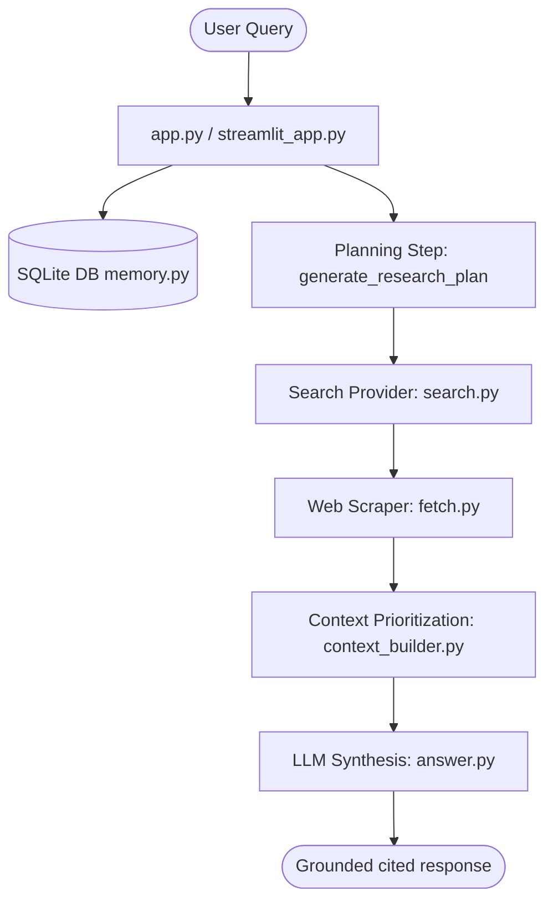

# Deep Research Agent

A framework-free, highly optimized Deep Research AI Agent built with pure Python, SQLite, Trafilatura, and Streamlit. Designed for real-time autonomous exploration, stateful multi-turn history tracking, relevance/recency/diversity context compilation, and advanced LLM-as-a-Judge evaluations.

---

# Part 1: Deep Research Agent Design Note

## 1. Executive Summary & Target Users
In the modern information landscape, professionals are inundated with data yet starved of precise knowledge. Traditional search engines return links, requiring users to open multiple tabs, read dense texts, filter irrelevant details, resolve contradictions, and manually synthesize the answers. 

This **Deep Research Agent** is designed to solve this specific pain point. Its target users are **researchers, financial analysts, policy makers, and software developers** who require high-fidelity, grounded answers synthesized from the real-time web. It bridges the gap between conversational search and systematic scientific investigation by automating the entire cycle of planning, searching, fetching, parsing, prioritizing, and grounding.

## 2. Definition of "Deep Research"
For this agent, **"Deep Research"** is defined as an autonomous, systematic information gathering and synthesis loop that:
1. **Plans Contextually**: Analyzes history to resolve coreferences and formulate an explicit research strategy instead of blindly querying raw user input.
2. **Prioritizes Quality and Diversity**: Evaluates extracted data across three independent dimensions: Relevance (information-retrieval term density), Recency (time-aware temporal weighting), and Source Diversity (progressive domain penalization to avoid single-source echo chambers).
3. **Identifies Epistemic Boundaries**: Explicitly flags contradictions between web sources and rigorously declines to answer when search context is insufficient, preventing hallucinations.
4. **Ensures Verifiability**: Grounds every claim in precise, inline, clickable markdown citations mapping back to validated domains and URLs.

---

## 3. System Architecture & Data Flows

### Architecture Diagram


### Modular Components
The agent's codebase is designed with a strict zero-dependency philosophy regarding high-level agentic frameworks (no LangChain, CrewAI, or LlamaIndex), using only standard library utilities and low-level HTTP clients:
* **Orchestrator (`app.py` / `streamlit_app.py`)**: Runs the linear agent execution loop, coordinates data passing between components, and handles real-time visual streaming of intermediate execution states.
* **Planning & Search (`search.py`)**: Resolves conversational pronouns and outputs a standalone optimized search query alongside an explicit 2-sentence research plan, executing search queries using the Tavily API.
* **Content Extractor (`fetch.py`)**: Concurrently processes page raw data using `requests` and parses clean articles using `trafilatura`, storing complete metadata (domain, original title, extraction timestamp).
* **Dynamic Context Prioritizer (`context_builder.py`)**: Segments documents, ranks them via TF-IDF scoring combined with temporal boosts and source-diversity domain penalization, and implements a unified summarization/pruning fallback chain.
* **Database & Memory (`memory.py`)**: Uses a persistent SQLite database storing multi-turn session records, rolling session summaries, and discrete turn-by-turn chat history.

### Database Schema
We select SQLite as our database model to maintain strict state persistence, full session continuity, and structured audit logs. The schema consists of three core tables:
```sql
CREATE TABLE IF NOT EXISTS sessions (
    session_id TEXT PRIMARY KEY,
    rolling_summary TEXT,
    created_at TIMESTAMP DEFAULT CURRENT_TIMESTAMP
);

CREATE TABLE IF NOT EXISTS turns (
    turn_id INTEGER PRIMARY KEY AUTOINCREMENT,
    session_id TEXT,
    query TEXT,
    search_queries TEXT, -- JSON array of search strings
    opened_urls TEXT,    -- JSON array of fetched URLs
    snippets TEXT,       -- JSON array of selected text snippets
    final_answer TEXT,
    timestamp TIMESTAMP DEFAULT CURRENT_TIMESTAMP,
    FOREIGN KEY(session_id) REFERENCES sessions(session_id)
);

CREATE TABLE IF NOT EXISTS messages (
    message_id INTEGER PRIMARY KEY AUTOINCREMENT,
    session_id TEXT,
    role TEXT,           -- 'user' or 'assistant'
    content TEXT,
    timestamp TIMESTAMP DEFAULT CURRENT_TIMESTAMP,
    FOREIGN KEY(session_id) REFERENCES sessions(session_id)
);
```

---

## 4. Prompt Engineering Strategy

### Grounding and Strict Citations
To eliminate hallucination, the agent uses a strict system prompt instruction set. The LLM is directed to act as an un-opinionated fact-compiler:
1. **Context-Only Boundaries**: The model is forbidden from using pre-trained parametric knowledge if it contradicts or goes beyond the provided context.
2. **Inline Citation Formatting**: Every single factual claim must be terminated with an inline citation formatted exactly as `[Title - Domain](URL)`. 
3. **No Hallucinatory Citations**: Citations must represent direct parent-child mappings back to the context chunks; invent-on-the-fly citations are prevented by formatting source blocks with unique keys in the system prompt.

### Conflict Detection
If the context chunks present divergent timelines, figures, or claims, the prompt instructs the model to explicitly synthesize the conflict (e.g., *"While Source A claims X, Source B contradicts this by stating Y"*).

### Token Management & Fallback Chain
To prevent context window overflow while preserving critical session memory, a multi-tier fallback algorithm is executed before calling the LLM:
1. **Tier 1 (Budget = 12,000 characters)**: Pass full conversation summary + last 2 raw chat turns + ranked web context chunks.
2. **Tier 2 (Fallback - History Pruning)**: If characters exceed 12k, prune the older conversational turns from the context.
3. **Tier 3 (Fallback - Summarization Collapse)**: If still exceeding, drop raw message logs entirely and provide only the SQLite rolling summary.
4. **Tier 4 (Fallback - Source Pruning)**: If still exceeding, progressively drop the lowest-ranked web context chunks one by one.

---

## 5. Evaluation Methodology

### Heuristics vs. LLM-as-a-Judge
Our testing harness (`advanced_eval.py`) implements a hybrid evaluation strategy:
* **Heuristic Metrics**: Highly efficient deterministic calculations:
  * **Citation Density**: Ratio of formatted markdown citations to sentences.
  * **Authoritative Presence**: Binary presence of highly credible domains (e.g. `.edu`, `.gov`, `nature.com`).
  * **Context Compression**: Ratio of final chunk characters to raw scraped characters.
  * **Source Diversity**: Distinct domain count ratio inside the utilized context.
* **LLM-as-a-Judge Metrics**: Leveraging `llama-3.3-70b-versatile` to evaluate semantic and high-cognitive structures:
  * **Grounding (Hallucination Detection)**: Strict binary check validating if all answer assertions are supported by the provided text chunks.
  * **Conflict Resolution**: Verifies that the model explicitly flags conflicting findings when multiple perspectives are present in the search results.
  * **Memory Continuity**: Assesses the model's ability to retain context and resolve coreferences over multi-turn queries.

### Rate Limiting and Dataset Construction
* **Groq Rate Limiter**: Shared programmatic sliding window prevents `429 Too Many Requests` API errors.
* **Robust Refusal Mapping**: Evaluators map answers against a complete set of standard refusal variations to ensure robust grading of uncertainty handling.
* **Standardized Dataset**: `advanced_eval_dataset.json` contains curated test cases challenging different agent capabilities: multi-turn coreference resolution, unanswerable historic facts, and highly debated scientific/medical topics.

---

# Setup & Execution Instructions

## 1. Quick Start
### Prerequisites
- Python 3.9+
- Groq API Key
- Tavily API Key

### Installation
```bash
pip install -r requirements.txt
```

### Environment Setup
Create a `.env` file in the root folder:
```env
TAVILY_API_KEY="tvly-your-tavily-api-key"
GROQ_API_KEY="gsk_your-groq-api-key"
```

---

## 2. Running the Applications

### Live Streaming Web Application (Streamlit)
To launch the beautiful, highly interactive research dashboard:
```bash
python -m streamlit run streamlit_app.py
```

### Interactive CLI Terminal Interface
To run the minimal CLI orchestrator:
```bash
python app.py
```

### Advanced Evaluation Harness
To execute the comprehensive LLM-as-a-Judge evaluation suite:
```bash
python advanced_eval.py
```
Outputs detailed summary parameters and writes granular trace-logs to `advanced_eval_results.json`.
